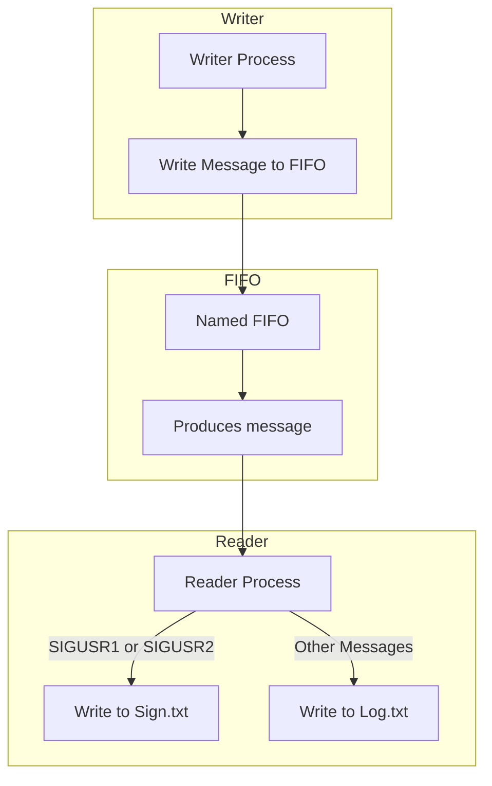

# OS IPC Final Project

***This project is for the OS course for the Embedded Systems Specialization at UBA.***

# Project Scope 

The purpose of this project is Inter-process Communication (IPC) using named FIFOS. The goal is straightforward as shown in the diagram below:


<style>
  .cluster-label span {
    background-color: gray;
    display: block;
    padding: 2px;
    border-radius: 5px;
    margin-left: 330px;
  }
</style>



# Installation and Dependecies


### Installing on Linux (Ubuntu)
- Make sure you have CMake installed, on Ubuntu run the following:
    ```bash
    sudo apt install cmake
    ```
### Installing on MacOS 
- Make sure you have CMake installed, on Mac run the following:
    ```bash
    brew install cmake
    ```
## Running

Run on your terminal the following:
```bash
chmod +x build.sh
```
and finally to build

```bash
./build.sh 
```
if you only want to build **AND** run the **WRITER**;
```bash
./build.sh -r 
```